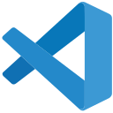

### 💻 Welcome to my GitHub page!

- I am currently studying  BSc(Hons) Computer Science at Goldsmiths, Univeristy of London.

### 👩‍💻 Languages and Tools :

<a href="https://go.dev/">
&nbsp;
</a>
<a href="https://www.javascript.com/">
&nbsp;
</a>
<a href="https://www.w3schools.com/css/default.asp">
&nbsp;
</a>
<a href="https://www.w3schools.com/html/">
&nbsp;
</a>
<a href="https://code.visualstudio.com/">
&nbsp;
</a>

<!--

https://github.com/devicons/devicon/tree/master/icons

Here are some ideas to get you started:

- 🔭 I’m currently working on ...
- 🌱 I’m currently learning ...
- 👯 I’m looking to collaborate on ...
- 🤔 I’m looking for help with ...
- 💬 Ask me about ...
- 📫 How to reach me: ...
- 😄 Pronouns: ...
- ⚡ Fun fact: ...
-->
